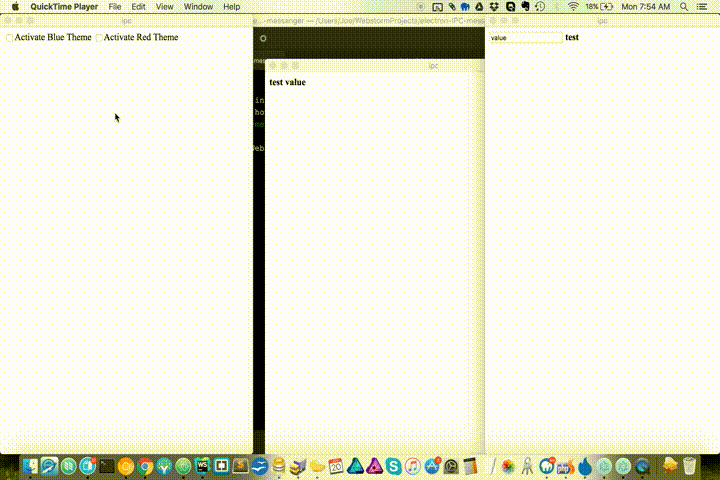

# Electron IPC Reactive

## Examples
```
// app.js
'use strict';
const {app,BrowserWindow} = require('electron');
app.on('ready',function(){
  // other init stuff here
  require('electron-ipc-reactive/main');
});
```
```
// renderer.js
require('electron-ipc-reactive');
```
```
<!-- index.html -->
<!doctype html>
<html>
  <body>
    <input type="checkbox" ipc-value-bind="theme_blue"/>
    <div ipc-class='{"blue":"theme_blue"}'></div>
    <input type="text" ipc-value-bind="textbox"/>
    <div ipc-value-bind="textbox"></div>
    <script src="renderer.js"></script>
  </body>
</html>
```

As always,
The source is the best documentation.

### Contributing
Feel free to send me a pull request
